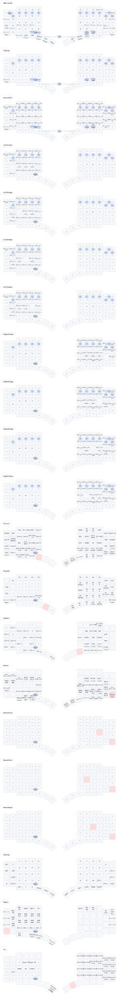

# MoErgo Go60 Custom Configuration for ZMK

## Keymap

The diagram above is rendered from [`config/go60.keymap`](config/go60.keymap) by [keymap-drawer](https://github.com/caksoylar/keymap-drawer). Regenerate locally with `./draw.sh`; CI also re-renders it on every push that touches the keymap.

## About

This repo is the official ZMK configuration of the MoErgo Go60 wireless split keyboard. Use it to develop your own keymap and easily build your own ZMK firmware to run on your Go60.

**NOTE: You can also customize the layout of your Go60 keyboard with the Go60 Layout Editor webapp. For most users Go60 Layout Editor is the recommended and simpler option. More information is available at the official MoErgo Go60 Support site (see resources below).**

These steps will get you using your keymap on your keyboard in the fastest time possible. This fork builds firmware locally (via Docker or Nix) rather than online — it has no GitHub Actions workflows.

If you are looking to dig deeper into ZMK and develop new functionality, it is recommended to follow the steps of installing ZMK as found on the official ZMK documentation site (linked below).

## Resources
- The [official MoErgo Go60 Support](https://moergo.com/go60-support) web site. Go60 documentation and other technical resources.
- The [official MoErgo Discord Server](https://moergo.com/discord). Instant conversations with other Go60 users.

- The [official ZMK Documentation](https://zmk.dev/docs) web site. Find the answers to many of your questions about ZMK Firmware.
- The [official ZMK Discord Server](https://discord.gg/8cfMkQksSB). Instant conversations with other ZMK developers and users. Great technical resource!

- The [official MoErgo ZMK Distribution](https://github.com/moergo-sc/zmk). Repository for ZMK firmware customized for Go60 and Glove80.

## Instructions
1. Log into, or sign up for, your personal GitHub account.
2. Create your own repository using this repository as a template ([instructions](https://docs.github.com/en/repositories/creating-and-managing-repositories/creating-a-repository-from-a-template)) and check it out on your local computer.
3. Edit the keymap file(s) to suit your needs
4. Run `./build.sh` to build a new version of your firmware with the updated keymap. See `docs.md` for the Nix alternative and build options.

## Firmware Files
To build your firmware and reflash your Go60...
1. Run `./build.sh` from the repo root. It builds in Docker and writes `go60.uf2` into the repo root.
2. Flash it with `./flash.sh`, which rebuilds and copies `go60.uf2` onto the mounted bootloader drive.
3. Alternatively, copy `go60.uf2` to the bootloader drive by hand, according to the user documentation on the official Go60 Support website (linked above)

Your keyboard is now ready to use.
